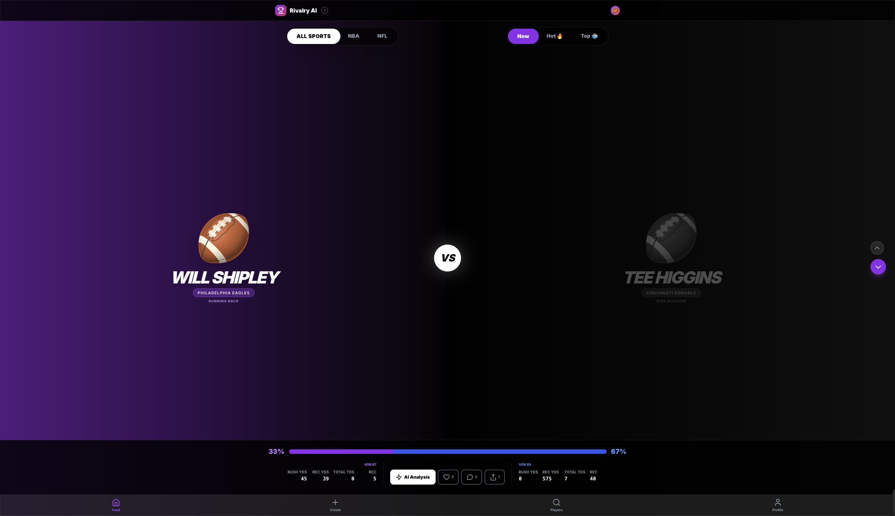
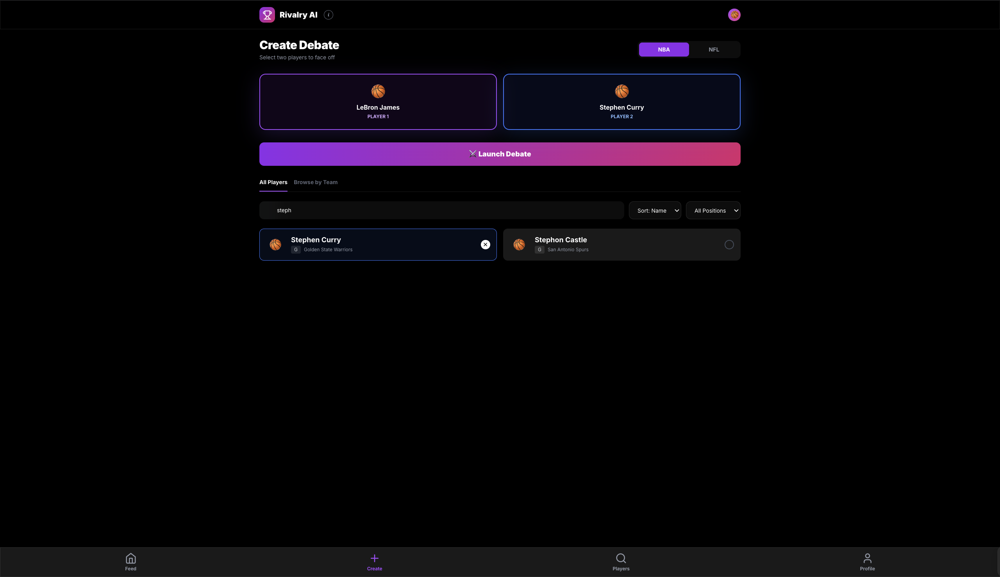
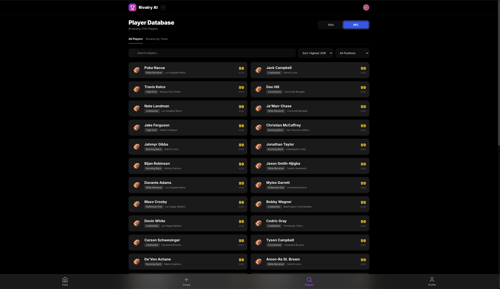
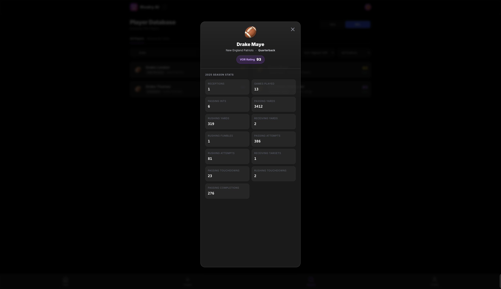

# 🏀 Rivalry AI

### AI-Powered Sports Debate Platform

[](https://rivalry-ai.onrender.com/)
[](https://www.python.org/)
[](https://reactjs.org/)

> Vote on NBA and NFL player matchups, unlock AI-generated analysis, and engage with data-driven sports debates.

**🔗 Live Demo:** [rivalry-ai.onrender.com](https://rivalry-ai.onrender.com/)

---

## 📋 Table of Contents
- [What is Rivalry AI?](#what-is-rivalry-ai)
- [Quick Start](#quick-start)
- [Features](#features)
- [How to Use](#how-to-use)
- [Tech Stack](#tech-stack)
- [How It Works](#how-it-works)
- [Contributing](#contributing)
- [License](#license)

---

## 🎯 What is Rivalry AI?

Rivalry AI is a sports debate platform where you can:
- Create head-to-head matchups between NBA and NFL players
- Vote on who's better (stats hidden until you vote)
- Get AI-powered analysis explaining the matchup
- Compare players fairly across different positions

**2,228 active players** from NBA and NFL ready to debate.

---

## 🚀 Quick Start

### Prerequisites
- Python 3.9+
- Git

### Setup

1. **Clone the repository**
```bash
git clone https://github.com/wilsonmurphy23/rivalry-ai.git
cd rivalry-ai
```

2. **Install dependencies**
```bash
pip install -r requirements.txt
```

3. **Set up environment variables**

Create a `.env` file:
```env
ANTHROPIC_API_KEY=your_api_key_here
SUPABASE_URL=your_supabase_url
SUPABASE_ANON_KEY=your_supabase_key
```

4. **Start the server**
```bash
python server.py
```
Server runs on `localhost:8000`

5. **Open the app**
- Open `index.html` in your browser
- Or run: `python -m http.server 3000`

**Live version:** [rivalry-ai.onrender.com](https://rivalry-ai.onrender.com/)

---

## 📸 Screenshots

### Main Feed

*Vote on player matchups with swipeable cards*

### Create Matchup

*Filter by sport, team, position, or search by name to create debates*

### Fog of War - Stats Locked

*Stats remain hidden until you vote - prevents bias*

### Players Page

*Browse all 2,228 players with VOR ratings and filters*

### Player Stats Detail

*Click any player to see detailed statistics and VOR breakdown*

---

## ✨ Features

## ✨ Features

### 🔒 Fog of War
Stats are hidden until you vote - prevents bias and makes debates more engaging.

### 📊 Fair Player Comparisons (VOR Algorithm)
Compare quarterbacks to linebackers fairly using position-specific statistical normalization. Every player gets a rating 40-99 where 75 = average.

### 🤖 AI Analysis
Get Claude 3 Haiku-powered analysis after voting. Cites specific stats and gives direct opinions.

### 🔍 Smart Search
- Filter by sport, team, position, or name
- 2,228 players with real-time stats
- Position-specific stat displays

### 🎮 Social Features
- Like and share matchups
- Comment on debates
- Unique URLs for each matchup
- Duplicate detection

---

## 📖 How to Use

## 📖 How to Use

**Create a Matchup:**
1. Go to "Create" tab
2. Select sport (NBA/NFL)
3. Filter by team, position, or search by name
4. Pick two players

**Vote and Analyze:**
1. View matchup in main feed
2. Vote (stats are hidden)
3. Stats reveal after voting
4. Click "Get AI Analysis" for breakdown

**Search Players:**
1. Go to "Players" tab
2. Use filters or search
3. View position-specific stats

---

## 🛠️ Tech Stack

- **Frontend**: React 18, Tailwind CSS
- **Backend**: Python, Supabase (PostgreSQL)
- **AI**: Claude 3 Haiku API
- **Data**: BallDontLie API
- **Deployment**: Render

---

## 🧮 How It Works

## 🧮 How It Works

### VOR Algorithm (Value Over Replacement)
Enables fair cross-position comparisons using 3 steps:

**Step 1: Calculate Raw Scores**
- Each position has custom formulas
- NBA: points, rebounds, assists, steals, blocks
- NFL QB: passing yards, TDs, interceptions
- NFL Defense: tackles, sacks, interceptions

**Step 2: Analyze Each Position Group**
- Calculate average and standard deviation per position
- Groups: NBA, NFL_QB, NFL_RB, NFL_WR, NFL_DEF, etc.

**Step 3: Normalize to 40-99 Scale**
- Use z-score transformation
- 75 = average, 85 = great, 90 = elite, 95 = exceptional
- Fair comparisons: QB rated 88 vs LB rated 85

### AI Integration
- **Proxy Server**: Python backend secures API keys
- **Smart Prompts**: Engineered to avoid generic responses
- **Format**: 2-3 sentence analysis with specific stats

---

## 🤝 Contributing

Pull requests welcome! 

1. Fork the repo
2. Create your feature branch (`git checkout -b feature/AmazingFeature`)
3. Commit changes (`git commit -m 'Add AmazingFeature'`)
4. Push to branch (`git push origin feature/AmazingFeature`)
5. Open a Pull Request

---

## 📝 License

MIT License - see [LICENSE](LICENSE) file

---

## 🔗 Links

- **Live Demo**: [rivalry-ai.onrender.com](https://rivalry-ai.onrender.com/)
- **GitHub**: [github.com/wilsonmurphy23/rivalry-ai](https://github.com/wilsonmurphy23/rivalry-ai)
- **Issues**: [Report a bug](https://github.com/wilsonmurphy23/rivalry-ai/issues)

---

## 🙏 Credits

- [Anthropic](https://www.anthropic.com/) - Claude 3 Haiku API
- [BallDontLie](https://www.balldontlie.io/) - NBA/NFL statistics
- [Supabase](https://supabase.com/) - Database and auth
- [Tailwind CSS](https://tailwindcss.com/) - Styling

---

<p align="center">Built with AI assistance • 2,228 players • 18 files • 6 weeks</p>
